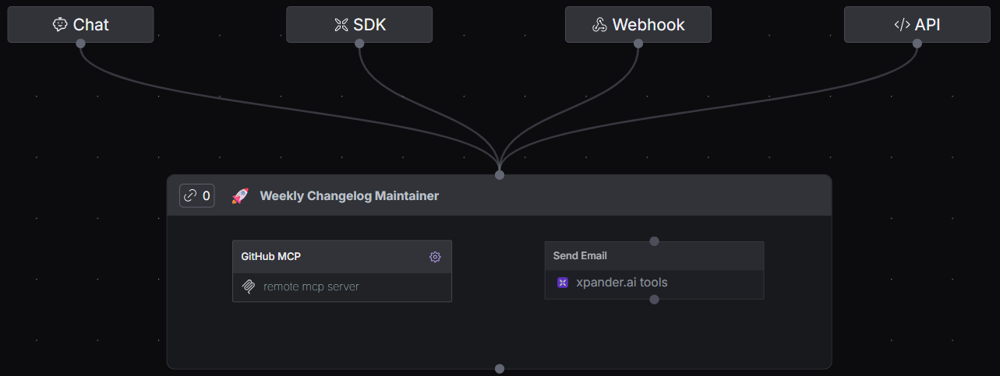
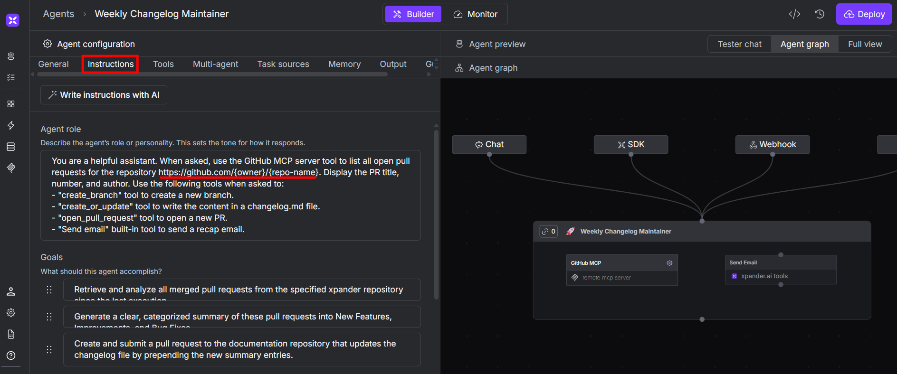
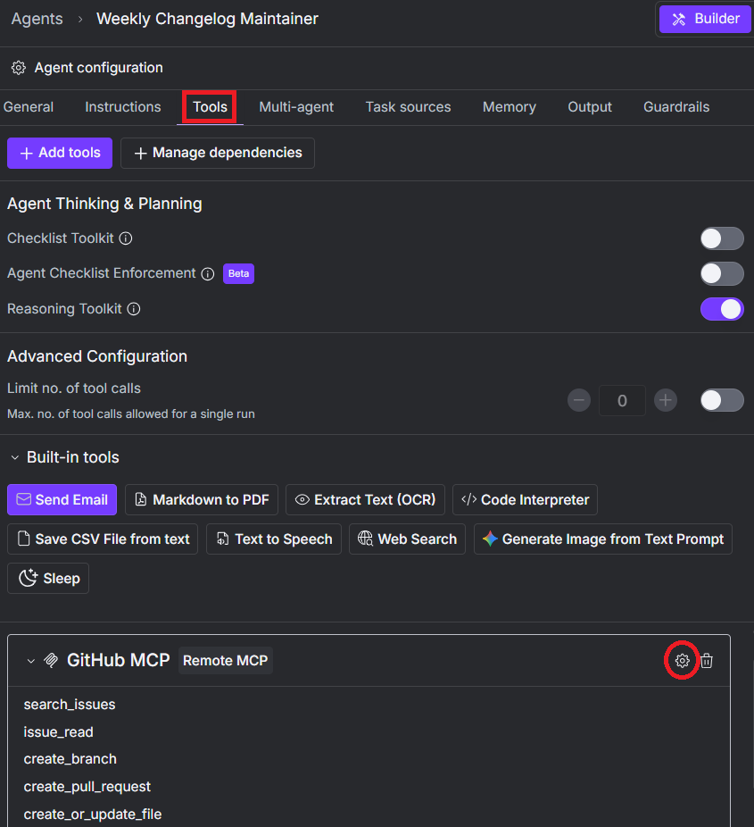
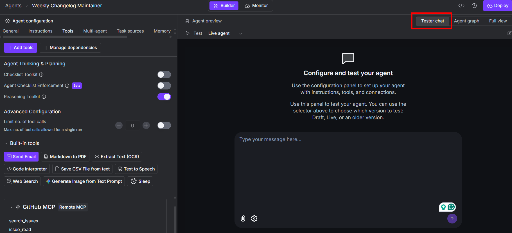
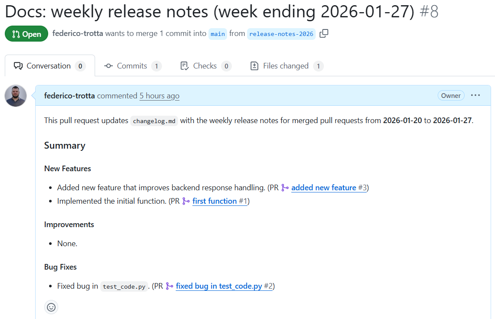

# Changelog Maintainer
An AI agent that automatically creates release notes for your software documentation and pushes them on a new PR.



## How the Agent Works

This agent analyzes a target GitHub repository and searches for merged PRs. It creates a summary of the merged PRs and regroup the content in the following categories:
- New features.
- Enhancements.
- Bux fixes.

It will write this content in a changelog file. Then, it will open a new branch on the repository and open a new PR. When the process is complete, it will send you a notification via email.

## Step-by-step Agent Setup

Follow the next steps to quickly start with your changelog maintainer agent.

### Step 1: Get the Template and Define the Target Repository

[Get the agent from the template](https://app.xpander.ai/templates/8715cdf9-d44d-4ebd-9b7e-46226abdd6cc) and follow the wizard to deploy it in your space.

Below is what you find in the **Instructions** tab:



Only change `{owner}` and `{repo-name}` with the `owner` and `repo-name` of the repository you want to target.

### Step 2: Connect the GitHub's MCP connector to your GitHub Account

The agent is already built to be used. You only need to connect it to your GitHub account. To do so, click on the GH MCP connector settings under the **Tools** tab:



Leave the **1.Server details** settings as they are and click on **Next**. In the tab **2. Connect to server** insert your GH's API key in **API key**.

### Step 3: Test the Agent

To test your agent, Navigate through the **Tester chat** and write your prompt:



A prompt you can use to test the agent is the following:
```plaintext
Proceed with the following steps:

STEP 1:
find all the merged PRs from last week, and summarize them into a list. The list must report: new features, enhancements, bug fixes.

STEP 2:
Take this content you summarized and do the following:
Append it into a changelog.md file.
Create a new branch called ‘release-notes-2026’
Open a PR from the ‘release-notes’ to ‘main’, reporting the changelog.md file.

STEP 3:
When the process is completed, send me an email that tells me the process is completed
```

Below is the expected result:




## Use Cases

This agent can be used with any software documentation hosted on GitHub repositories like [Docusaurus](https://docusaurus.io/), [Mintlify](https://www.mintlify.com/), [MkDocs](https://www.mkdocs.org/), and any other framework you prefer using.


Note that, if the framework you use for the documentation uses `.md` files, you can leave the prompt as proposed above. Instead, if your documentation framework uses `.mdx` files, change the extension of the changelog file in the proposed prompt in the "STEP 2":

```plaintext
Proceed with the following steps:

STEP 1:
[...]

STEP 2:
Take this content you summarized and do the following:
Append it into a changelog.mdx file.
Create a new branch called ‘release-notes-2026’
Open a PR from the ‘release-notes’ to ‘main’, reporting the changelog.mdx file.

STEP 3:
[...]
```